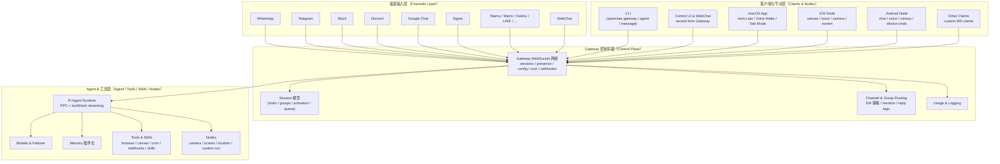
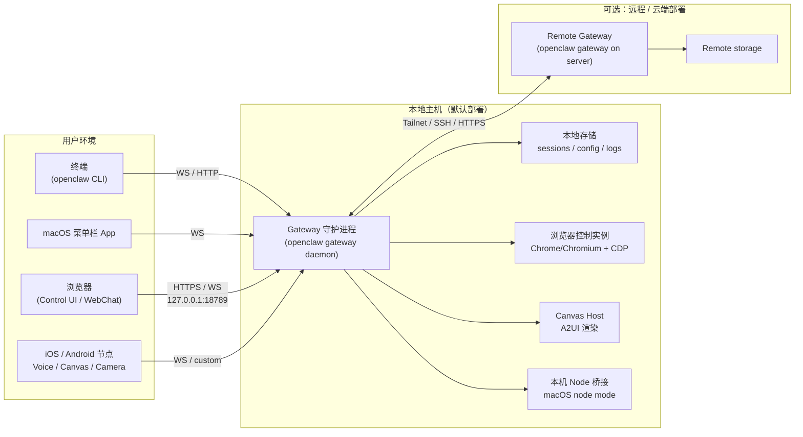
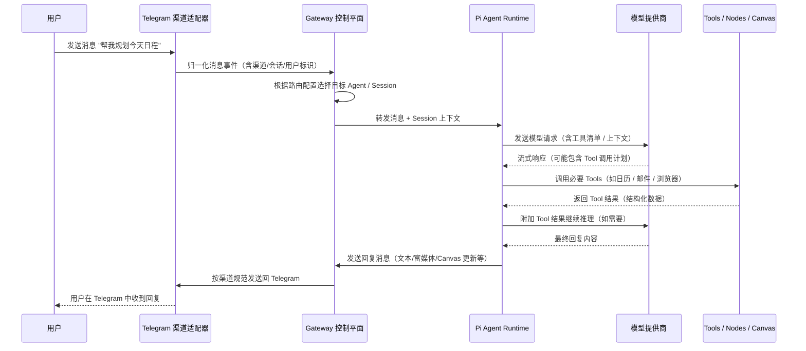

### OpenClaw 架构设计文档（简体中文）

> 本文基于 GitHub 主线仓库 [`openclaw/openclaw`](https://github.com/openclaw/openclaw) 的公开资料整理，主要参考：  
> - `README.md`：项目总览与子系统列表  
> - `VISION.md`：愿景、安全与插件策略  
> 文中所有架构描述均以这两份文档为主 \[[README](https://github.com/openclaw/openclaw/blob/main/README.md), [VISION](https://github.com/openclaw/openclaw/blob/main/VISION.md)\]。

---

### 一、系统定位与目标

- **系统定位**：OpenClaw 是一个运行在你自己设备上的**个人 AI 助手**，通过统一的 Gateway 控制平面，把多种「消息渠道」「终端设备」「模型提供商」「工具/技能」集成为一个始终在线的助手。
- **核心愿景**：  
  - *“OpenClaw is the AI that actually does things.”* —— 不只是对话，而是能真正执行任务：发消息、查邮件、开网页、操作桌面与手机、定时任务等。
- **设计目标**：
  - **本地优先与隐私**：默认网关跑在本机，由用户掌控数据与访问方式。
  - **多渠道聚合**：统一处理 WhatsApp / Telegram / Slack / Discord / Signal / iMessage / Teams / Matrix / Feishu / LINE 等几十个渠道。
  - **多终端协同**：macOS 菜单栏 App、iOS/Android 节点、WebChat、CLI 共用同一个 Gateway。
  - **强安全默认**：DM pairing、群组路由策略、模型 failover、安全文档、doctor 工具等。
  - **可扩展编排**：通过 Tools / Skills / Plugins / Nodes / Cron / Webhooks 等构建自动化工作流。

---

### 二、宏观逻辑架构

从宏观上，OpenClaw 可以拆分为四个层次：

1. **渠道输入层（Channels Layer）**：对接外部 IM / 协作 / WebChat 渠道。
2. **Gateway 控制平面（Gateway / Control Plane）**：统一的 WebSocket 控制中枢。
3. **Agent & 工具层（Agent / Tools / Skills / Nodes）**：负责推理、工具调用与自动化。
4. **客户端与节点层（Clients & Nodes）**：CLI、Web UI、macOS/iOS/Android 节点等。

#### 2.1 逻辑架构图（Mermaid）

---

### 三、进程与部署架构

#### 3.1 运行模式概览

- **本地单机模式（推荐）**：
  - Gateway 作为守护进程常驻运行（launchd/systemd user service）。
  - 所有客户端（CLI、Web、桌面、移动节点）通过本机 WebSocket/HTTP 接入。
- **远程访问模式**：
  - 使用 Tailscale Serve/Funnel 或 SSH Tunnel，将 Gateway Dashboard + WebSocket 暴露到 tailnet 或公网。
  - 通过 token/password 等额外机制加固访问控制。
- **打包与管理**：
  - 支持 Nix 声明式配置、Docker 部署。
  - 提供 `openclaw doctor` 做健康检查、迁移与日志分析。

#### 3.2 进程部署图（Mermaid）

---

### 四、核心子系统简要说明

> 以下内容对应 README 中的「Everything we built so far / Key subsystems」章节做结构化整理。

#### 4.1 Gateway 控制平面

- 统一的 WebSocket 网络，负责：
  - 会话管理（Session）、Presence、Typing Indicators。
  - 渠道与群组路由（Channel & Group Routing）。
  - Cron、Webhooks、Gmail Pub/Sub 等自动化触发。
  - Usage Tracking 与日志。

#### 4.2 渠道适配（Channels）

- 对接各类 IM / 协作平台：
  - WhatsApp（Baileys）、Telegram（grammY）、Slack（Bolt）、Discord（discord.js）、Google Chat、Signal（signal-cli）、Matrix、Feishu、LINE、Mattermost、Nextcloud Talk、Nostr、Synology Chat、Twitch、Zalo 等。
- 提供：
  - 消息/媒体收发。
  - DM pairing + allowlist 安全控制。
  - 群组中的 @mention / reply tag 路由。

#### 4.3 Agent Runtime（Pi Agent）

- 在 RPC 模式下运行，负责：
  - 将 Gateway 标准化的事件 + Session 上下文发送给模型。
  - 处理模型对 Tools 的调用（tool streaming / block streaming）。
  - 根据会话策略将结果推送回对应 Channel/Node/Canvas。

#### 4.4 Tools / Nodes / Canvas / Skills

- **浏览器控制**：通过 CDP 控制专属 Chrome/Chromium，进行网页快照、点击、输入等复杂操作。
- **Canvas + A2UI**：由 Gateway 托管的可视化工作区，Agent 通过 A2UI 协议驱动 UI 状态与交互。
- **Nodes**：iOS / Android / macOS Node 提供摄像头、屏幕录制、位置、通知、系统命令等能力。
- **Cron & Webhooks**：基于时间或外部事件驱动的自动化工作流。
- **Skills 平台**：核心只保留少量内置技能，更多技能通过 ClawHub / 社区插件形态分发。

#### 4.5 模型与记忆（Models & Memory）

- **模型选择与鉴权**：
  - 支持 OpenAI 等多个提供商，通过统一 Models 配置与 CLI 管理。
  - Auth Profile（OAuth vs API Key）轮换与模型 failover 策略。
- **Memory 插件槽位**：
  - 同一时间仅一个 Memory 插件生效，负责长时记忆存取。
  - 多个实现方案并行存在，后续会收敛为推荐路径。

#### 4.6 安全与运维

- 将所有外部 DM 视为不可信输入，默认需要 pairing / allowlist。
- 专门的 Security 文档与 Doctor 工具，用于检查风险配置与运维问题。
- 对于 MCP，采用 `mcporter` 作为桥接层，而非直接将 MCP runtime 内置在核心中，以降低耦合与安全面 \[[VISION](https://github.com/openclaw/openclaw/blob/main/VISION.md)\]。

---

### 五、典型交互时序（示例）

以下以「用户在 Telegram 给 OpenClaw 发送一条消息，经过 Gateway 与 Agent 处理后返回回复」为例。

#### 5.1 时序图（Mermaid）

---

### 六、总结

OpenClaw 通过 **Gateway WebSocket 控制平面 + 多渠道适配 + Agent Runtime + Tools/Nodes/Canvas + Skills 平台**，构建了一个围绕「个人设备与私有渠道」的 AI 助手体系：

- 在架构上，强调**控制平面与执行面的分离**：Gateway 管控会话与事件，Agent/Tools/Nodes 负责具体执行。
- 在安全上，坚持**强默认安全策略**：DM pairing、allowlist、显式的风险配置开关。
- 在扩展上，通过 Skills/Plugins/mcporter 将功能与核心解耦，方便社区与第三方生态扩展。

这份文档可作为你评估与二次开发 OpenClaw 的高层架构参考，若后续你希望对某个子系统（如 Channels、Canvas、Nodes、Skills、mcporter 集成等）做更深层的设计拆解，我们可以在此基础上继续细化子架构文档。

