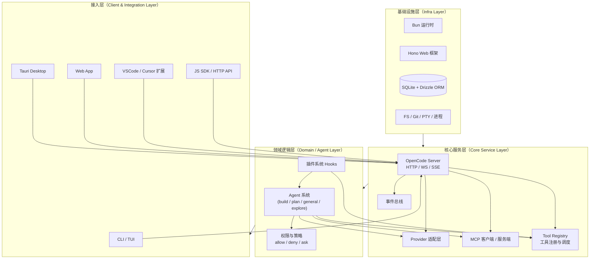
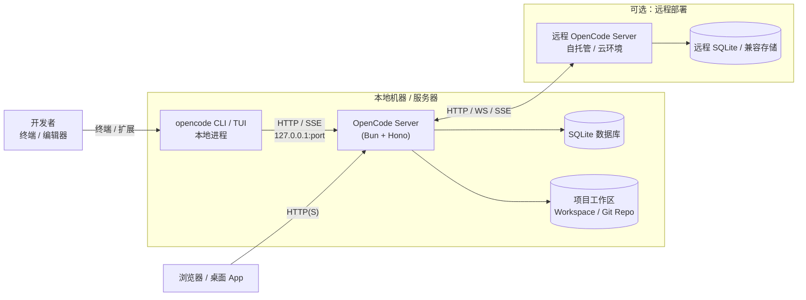

### OpenCode 架构设计文档（简体中文）

> 本文基于开源项目 `opencode`（上游仓库为 `anomalyco/opencode`）代码与文档的整体分析，面向希望二次开发、集成或评估 OpenCode 的工程团队。

---

### 一、系统定位与设计目标

- **系统定位**：开源的 AI Coding Agent 平台，提供统一的 Agent + Tool 编程范式，运行在本地或自托管环境中，为终端、桌面、浏览器和编辑器扩展等多种客户端提供 AI 编码能力。
- **核心理念**：
  - **Provider 无锁定**：通过统一 Provider 抽象接入 Anthropic、OpenAI、Google、Bedrock、本地模型等数十种提供商。
  - **Client/Server 架构**：CLI/TUI、Desktop、Web、VSCode 扩展等只是不同客户端，统一连接同一个 OpenCode Server。
  - **Agent + Tool 模型**：Agent 负责“理解与决策”，Tool 负责“真实世界操作”（文件、Shell、MCP、浏览器等）。
  - **可配置 & 可扩展**：通过配置文件、插件系统、MCP 集成和自定义工具，实现团队级的统一规范与扩展能力。

**非目标**：

- 不试图替代完整 IDE，而是与 VSCode、Cursor 等编辑器协同工作。
- 不绑定任意云厂商，保持本地优先和自托管能力。

---

### 二、宏观架构概览

从自底向上，可以将 OpenCode 拆分为四个主要层次：

1. **基础设施层（Infra Layer）**
   - 运行时：Bun
   - Web 框架：Hono（HTTP / WebSocket / 中间件）
   - 数据库：SQLite + Drizzle ORM
   - 系统能力：文件系统、Git、PTY（终端）、进程管理等

2. **核心服务层（Core Service Layer）**
   - OpenCode Server（会话与项目管理、事件总线）
   - Provider 适配层（多云 / 本地模型）
   - MCP 客户端/服务端支持
   - Tool 注册与执行引擎

3. **领域逻辑层（Domain / Agent Layer）**
   - Agent 系统（build / plan / general / explore 等）
   - 指令与权限策略（工具允许/禁止/询问）
   - 插件系统与 Hook 机制

4. **接入层（Client & Integration Layer）**
   - CLI + TUI（终端 UI）
   - Desktop（Tauri 桌面应用）
   - Web（浏览器客户端）
   - VSCode 扩展、ACP 客户端（如 Zed）
   - JS SDK / HTTP API（供其他系统集成）

#### 2.1 逻辑架构图

#### 2.2 进程部署图

---

### 三、Monorepo 结构与主要包

OpenCode 使用 Turborepo + Bun 管理的 Monorepo，主要模块包括（名称为示意，具体以 `packages/` 为准）：

- `packages/opencode`
  - **核心服务包**，包含：
    - CLI 入口（如 `opencode tui`、`opencode serve` 等）
    - Server 实现（HTTP API / 事件流）
    - Agent / Tool / Provider / MCP / 插件等核心逻辑

- `packages/app`
  - Web UI（基于 SolidJS）
  - 为 Desktop（Tauri）和 Web 版本提供共享 UI 组件

- `packages/desktop`
  - 基于 Tauri 封装的桌面应用（调用 `packages/app` 作为前端）

- `packages/web`
  - 文档 & 官网站点（Astro）

- `packages/plugin`
  - 插件 SDK：`@opencode-ai/plugin`
  - 提供用于编写插件与自定义 Tool 的 TypeScript API

- `packages/sdk/js`
  - JS/TS SDK：`@opencode-ai/sdk`
  - 基于 OpenAPI 生成，提供访问 Server 的类型安全客户端

- `packages/ui`
  - 通用 UI 组件（主要服务于 Web/Desktop/TUI）

- 其他功能性包
  - 如 `packages/slack`、`packages/function`、`packages/enterprise` 等，用于特定集成与企业特性。

---

### 四、核心服务层设计

#### 4.1 Server 核心服务

- **典型职责**：
  - 提供 HTTP REST 接口与 WebSocket/SSE 事件流。
  - 管理项目（Project）与工作目录（Worktree）。
  - 管理会话（Session）与消息历史（Message History）。
  - 调度并执行来自 Agent 的 Tool 调用。
  - 管理配置、Provider、MCP 连接与插件生命周期。

- **典型 API（抽象示例）**：
  - `POST /session`：创建新的会话。
  - `GET /session`：列出现有会话。
  - `POST /session/:id/message`：发送用户消息 / Tool 结果。
  - `GET /event`：SSE 事件流（TUI/Web 用于实时更新）。
  - 其他如 `/project`、`/file`、`/config`、`/provider`、`/mcp` 等。

#### 4.2 项目与存储

- 每个项目对应一个工作目录（或多个 worktree），Server 使用路径与内部 ID 进行管理。
- 会话与消息通常存储在 SQLite 数据库中：
  - 通过 Drizzle ORM 定义 schema。
  - 支持查询近期会话、消息历史等。
- 配置、插件、工具脚本等以文件形式存在：
  - 全局配置：`~/.config/opencode/`
  - 项目配置：项目根目录的 `opencode.json` 与 `.opencode/` 子目录。

---

### 五、Agent 系统设计

#### 5.1 Agent 概念

在 OpenCode 中，Agent 是“有角色、有工具、有策略的语言模型会话体”的抽象。一个 Agent 至少包含：

- 使用的模型：如 `anthropic/claude-3-5-sonnet-20241022`。
- 系统指令（instructions）：定义角色、风格、行为边界。
- 工具列表：当前 Agent 可以调用哪些工具。
- 权限策略：对每个工具/工具前缀设定 `allow` / `deny` / `ask`。

#### 5.2 内置 Agent

- **build Agent**
  - 默认 Agent，面向日常开发。
  - 默认允许读写文件、执行 shell 等常用工具。

- **plan Agent**
  - 只读/低风险 Agent，面向代码分析与规划。
  - 默认拒绝文件写入、危险命令。
  - 执行 shell 前会先询问用户。

- **子 Agent**
  - `general`：适合复杂搜索、多步任务，可以内部并行使用工具。
  - `explore`：更偏重只读的代码探索（grep/glob/read 等）。

#### 5.3 Agent 配置来源

- 全局或项目级 `opencode.json` 中的 `agent` 字段。
- `.opencode/agents/` 目录下的配置文件。
- 用户可以新增自定义 Agent，并在 TUI 中切换。

---

### 六、Tool 系统设计

#### 6.1 内置 Tool 类型

按功能大类划分，常见工具包括（非完整列表）：

- **文件与项目**
  - `read`：读取文件内容（支持行范围）。
  - `write`：新建或覆盖写入文件。
  - `edit` / `apply_patch`：基于差异/精确片段进行编辑。
  - `list`：列出目录内容。
  - `glob`：根据模式查找文件。
  - `grep`：基于 ripgrep 搜索内容。

- **执行与任务**
  - `bash`：执行 shell 命令（有安全控制）。
  - `task`：任务管理/调度。

- **协作与元信息**
  - `todowrite` / `todoread`：管理会话内 Todo 列表。
  - `question`：在工具执行过程中向用户提问。
  - `skill`：加载技能文档（`SKILL.md`）。

- **网络与搜索**
  - `webfetch`：抓取网页内容。
  - `websearch` / `codesearch`：依托上游能力进行 Web / 代码搜索。

#### 6.2 Tool 注册与执行流

1. Agent 通过 LLM 产生一次 Tool 调用意图（包含工具名与参数）。
2. Server 在 Tool Registry 中查找对应实现：
   - 内置工具。
   - 配置目录 `.opencode/tools/` 中的自定义工具。
   - 插件提供的工具。
   - MCP 服务器导出的工具。
3. 按当前 Agent 的权限策略判断：
   - `allow`：直接执行。
   - `ask`：向用户弹出确认（TUI 或其它交互）。
   - `deny`：拒绝并返回错误信息给 Agent。
4. 执行工具实现：
   - 工具可以读写文件、执行命令、调用 HTTP、访问数据库等。
   - 工具执行前/后可被插件 hooks 拦截和增强。
5. 将结果封装为结构化响应，发送回 Agent 作为后续对话的上下文。

#### 6.3 自定义 Tool

- 开发者可在 `.opencode/tools/` 或全局配置目录中放置自定义工具文件。
- 使用 `@opencode-ai/plugin` 提供的 `tool()` 方法定义：
  - 描述（description）
  - 参数 schema（基于 Zod）
  - 执行函数（execute）

---

### 七、Provider 多模型子系统

#### 7.1 统一 Provider 抽象

- 通过 Provider 层，将 Anthropic、OpenAI、Google、Bedrock、本地模型等统一为：
  - **模型标识**：`provider-id/model-id`
  - **统一调用接口**：屏蔽差异化 API。
  - **统一错误与限流处理**：为上层 Agent 层提供一致体验。

#### 7.2 配置与凭证管理

- 凭证存储：
  - 默认在用户目录下的 `auth.json`（路径视平台与实现而定）。
  - 支持通过环境变量注入（如 `OPENAI_API_KEY`、`ANTHROPIC_API_KEY` 等）。
- 配置方式：
  - 在 `opencode.json` 的 `provider` 字段中配置：
    - 自定义 baseURL（代理/自托管）。
    - 模型别名与上下文/输出限制。
    - 本地部署模型的连接信息（Ollama/LM Studio 等）。

#### 7.3 本地模型支持

- 对 OpenAI-compatible HTTP API 进行统一封装。
- 用户可以通过配置将本地模型端点暴露给 OpenCode 作为普通 Provider 使用。

---

### 八、MCP（Model Context Protocol）支持

#### 8.1 MCP Client 能力

- OpenCode 可以作为 MCP Client 连接多个 MCP Server：
  - 本地 MCP（通过 stdio 命令行进程）。
  - 远程 MCP（通过 HTTP/SSE/流式协议）。
- MCP Server 暴露的工具、资源、Prompt 等会被动态注册为 OpenCode 的工具集合。

#### 8.2 配置示意（抽象）

- 在 `opencode.json` 的 `mcp` 字段中：
  - 声明 server 名称、类型（local/remote）、命令/URL。
  - 配置环境变量、headers、超时时间等。
  - （可选）配置 OAuth 参数或关闭 OAuth。

#### 8.3 权限与命名

- 为避免冲突，MCP 导出的工具通常带有前缀（例如 `<server>_*`）。
- 可通过权限系统为 MCP 工具整体或按前缀开启/禁用。

---

### 九、插件系统设计

#### 9.1 插件来源

- 本地目录：
  - 项目级：`.opencode/plugins/`
  - 全局级：`~/.config/opencode/plugins/`
- npm 包：
  - 在 `opencode.json` 里通过 `plugin: ["your-plugin"]` 声明。

#### 9.2 插件能力与 Hook 类型

- 典型 Hook（示例，非完整）：
  - `config`：动态修改配置。
  - `tool`：注册自定义工具。
  - `tool.execute.before` / `tool.execute.after`：拦截工具调用。
  - `chat.message`：观察/修改对话消息。
  - `chat.params`：调整模型参数（温度、topP、系统 Prompt 等）。
  - `shell.env`：为 Shell 执行注入环境变量。
  - `permission.ask`：自定义权限交互风格。

#### 9.3 插件开发体验

- 插件开发基于 `@opencode-ai/plugin`：
  - 提供类型安全的 Plugin 接口。
  - 插件可以访问：
    - 当前项目与 worktree 信息。
    - OpenCode SDK 客户端。
    - Bun Shell（`$`）用于执行命令。

---

### 十、配置体系与优先级

#### 10.1 配置来源

按优先级从低到高大致为：

1. 组织级 `.well-known/opencode`（用于设定默认规范）。
2. 全局配置文件（例如 `~/.config/opencode/opencode.json{c}`）。
3. 环境变量指定的额外配置文件或内容。
4. 项目根目录的 `opencode.json{c}`。
5. `.opencode/` 目录下的细粒度配置：
   - `agents/`、`tools/`、`plugins/`、`skills/`、`commands/` 等。
6. Inline 配置（环境变量直接注入 JSON 内容）。
7. 企业托管配置目录（如存在，则通常具有最高优先级）。

#### 10.2 配置内容

常见字段包括：

- `model`：默认模型。
- `provider`：各 Provider 详细配置。
- `mcp`：MCP 服务器配置。
- `agent`：Agent 集合定义。
- `plugin`：启用的插件列表。
- `command`：自定义命令。
- `permission`：工具权限策略。
- `instructions`：全局/默认指令集合。
- `experimental`：实验性特性开关。

---

### 十一、接入层与客户端形态

#### 11.1 CLI / TUI

- CLI 命令（如 `opencode tui`、`opencode serve`）是最主要的使用入口。
- TUI 通过 HTTP/SSE 与 Server 通信：
  - 发送用户输入、展示 Agent 回复。
  - 实时接收事件（如工具执行进度、消息流）。

#### 11.2 Desktop & Web

- Desktop 使用 Tauri，将 Web UI 打包为桌面应用。
- Web 通过浏览器访问 Server 暴露的 `/app` 路由，加载前端资源。

#### 11.3 编辑器扩展与 SDK

- VSCode 扩展（也可在 Cursor 中使用）：
  - 在编辑器中打开集成终端，自动启动 `opencode --port <随机端口>`。
  - 利用 HTTP API（如 `/tui/append-prompt`）将当前文件/选区引用发送给 TUI。
- JS SDK：`@opencode-ai/sdk`
  - 编程式访问 Server API，用于集成 CI、内部工具、Bot 等。

---

### 十二、典型交互时序（示例）

以用户在 TUI 中请求“重构一个函数”为例：

1. 用户在 TUI 输入自然语言需求。
2. TUI 将输入通过 HTTP 发送到 Server 的会话接口。
3. Server 根据会话绑定的 Agent（如 build）：
   - 组装上下文（历史消息、项目配置、技能等）。
   - 通过 Provider 调用对应模型。
4. 模型决定调用若干工具（如 `glob` → `read` → `apply_patch`）：
   - Server 逐个检查权限并执行 Tool。
   - 工具执行期间，插件可能对输入/输出进行增强或记录。
5. 模型在数轮 Tool 调用后生成最终回复与补丁。
6. TUI 通过事件流收到消息与变更摘要，用户可以审查与确认。

---

### 十三、总结

OpenCode 通过 **Client/Server 架构 + Agent/Tool 抽象 + Provider/MCP/插件扩展**，构建了一个高度可配置、可扩展、Provider 无锁定的 AI 编程平台：

- 对个人用户：提供 TUI/桌面/Web/编辑器多终端体验，可在本地安全使用多家模型与本地模型。
- 对团队与企业：提供多层级配置、插件与 MCP 集成能力，方便将内部系统与工作流统一接入 AI Agent。

在此基础上，项目保持 100% 开源，方便你根据自身业务场景进行二次开发与深度集成。

